# AWS DevOps Capstone — End-to-End CI/CD, Infrastructure Automation & Blue-Green Deployment

> A hands-on AWS DevOps capstone that combines Infrastructure as Code, configuration management, CI/CD, container security, code quality, observability, and custom Blue-Green application deployment.

This project demonstrates how multiple DevOps tools can work together while keeping **clear ownership between infrastructure and application delivery**.

The implementation is intentionally built as a practical learning project rather than relying on AWS CodeDeploy for deployment orchestration.

---

## Project Overview

The goal of this capstone is to build an automated DevOps workflow for a containerized web application running on **Amazon ECS Fargate**.

The project contains two independent delivery paths:

## Architecture Diagram

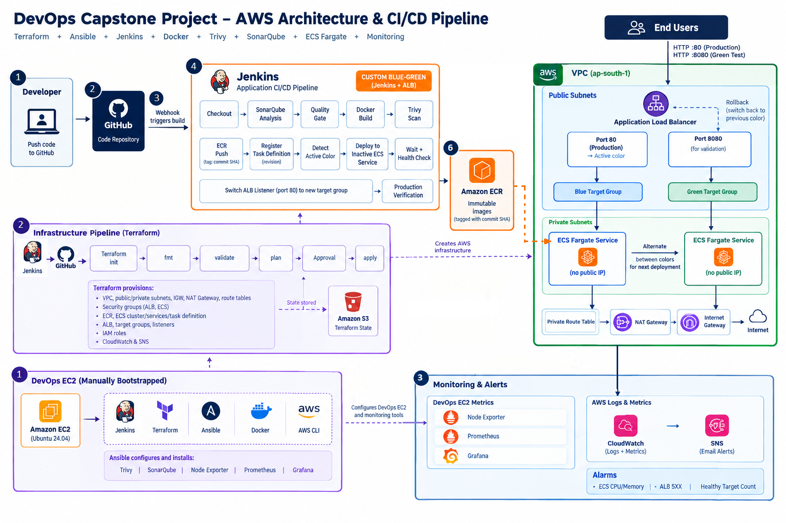

In short,

```text
                                  INTERNET
                                      |
                                      v
                            +-------------------+
                            |   Application     |
                            |   Load Balancer   |
                            |      :80          |
                            +---------+---------+
                                      |
                         Production Listener
                                      |
                    +-----------------+-----------------+
                    |                                   |
                    v                                   v
             +-------------+                     +-------------+
             |  BLUE TG    |                     |  GREEN TG   |
             +------+------+                     +------+------+
                    |                                   |
                    v                                   v
          +------------------+                 +------------------+
          | Blue ECS Service |                 | Green ECS Service|
          |    Fargate       |                 |     Fargate      |
          +--------+---------+                 +--------+---------+
                   |                                    |
                   +----------------+-------------------+
                                    |
                           Private Subnets
                                    |
                                    v
                             NAT Gateway
                                    |
                                    v
                               Internet
```

Only the active target group receives production traffic through the port 80 listener.

The other ECS service can remain available for validation and fast rollback.

## Pipeline Flow

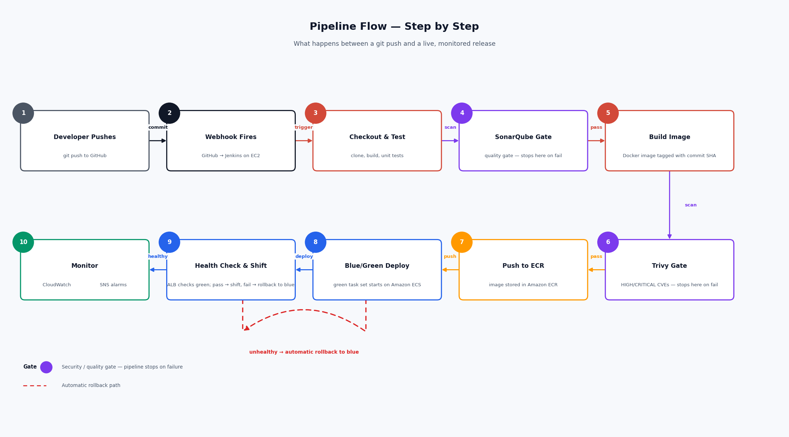

### Infrastructure path

```text
GitHub
   |
   v
Jenkins
   |
   v
Terraform
   |
   +--> VPC
   +--> Subnets
   +--> NAT Gateway
   +--> Security Groups
   +--> ECR
   +--> ECS
   +--> ALB
   +--> IAM
   +--> CloudWatch
   +--> SNS
   |
   v
AWS Infrastructure
```

### Application path

```text
Developer
   |
   v
GitHub
   |
   v
Jenkins
   |
   +--> SonarQube
   +--> Quality Gate
   +--> Docker Build
   +--> Trivy Scan
   +--> ECR Push
   +--> ECS Deployment
   +--> Health Validation
   +--> ALB Traffic Switch
   |
   v
Production Application
```

The two paths deliberately have different responsibilities.

**Terraform manages infrastructure.**

**Jenkins manages application delivery.**

This prevents an application deployment from unnecessarily recreating AWS infrastructure.

---

## What This Project Demonstrates

The completed project covers:

- AWS VPC networking
- Public and private subnets
- Internet Gateway
- NAT Gateway
- Route tables
- Security Groups
- Application Load Balancer
- Amazon ECR
- Amazon ECS Fargate
- ECS task definitions
- Two ECS services for Blue-Green deployment
- Two ALB target groups
- ALB listener traffic switching
- IAM roles
- CloudWatch Logs
- CloudWatch alarms
- SNS notifications
- Amazon S3 Terraform backend
- Terraform modules
- Ansible roles
- Jenkins pipelines
- GitHub webhook-triggered CI/CD
- Docker containerization
- SonarQube code analysis
- Trivy security scanning
- Prometheus metrics
- Node Exporter
- Grafana dashboards
- Grafana alerting
- Automated application verification
- Custom Blue-Green deployment
- Fast Blue-Green rollback

---

## Technology Stack

| Technology | Purpose |
|---|---|
| AWS | Cloud platform |
| Terraform | Infrastructure as Code |
| Ansible | Server configuration |
| Jenkins | CI/CD orchestration |
| GitHub | Source control |
| Docker | Application containerization |
| Trivy | Container vulnerability scanning |
| SonarQube | Static code analysis |
| Amazon ECR | Container image registry |
| Amazon ECS Fargate | Container runtime |
| Application Load Balancer | Application traffic routing |
| CloudWatch | AWS logs, metrics and alarms |
| SNS | AWS alert notifications |
| Prometheus | Metrics collection |
| Node Exporter | Linux host metrics |
| Grafana | Monitoring dashboards and alerts |
| Amazon S3 | Terraform remote state |

---

### Repository Structure

The repository is organized so that application, infrastructure and server-configuration responsibilities remain separate.

```text
capstone-project-devops-cicd-ecs/
│
├── Jenkinsfile
├── sonar-project.properties
├── README.md
│
├── app/
│   ├── Dockerfile
│   └── index.html
│
├── ansible/
│   ├── ansible.cfg
│   ├── inventory.ini
│   ├── requirements.yml
│   ├── site.yml
│   │
│   ├── roles/
│   │   ├── trivy/
│   │   ├── sonarqube/
│   │   ├── node_exporter/
│   │   ├── prometheus/
│   │   └── grafana/
│   │
│   └── playbooks/
│
└── terraform/
    ├── main.tf
    ├── variables.tf
    ├── outputs.tf
    ├── terraform.tfvars
    │
    └── modules/
        ├── vpc/
        ├── security/
        ├── ecr/
        ├── iam/
        ├── alb/
        ├── ecs/
        └── cloudwatch/
```

---

### Tool Responsibilities

A major design goal is to avoid overlapping responsibilities.

| Tool | Responsibility |
|---|---|
| GitHub | Source code and version control |
| Jenkins | Pipeline orchestration |
| Terraform | AWS infrastructure |
| Ansible | DevOps server configuration |
| Docker | Build application image |
| SonarQube | Code quality analysis |
| Trivy | Security scanning |
| ECR | Store container images |
| ECS Fargate | Run containers |
| ALB | Route application traffic |
| Prometheus | Collect host metrics |
| Node Exporter | Expose Linux metrics |
| Grafana | Visualize metrics and create alerts |
| CloudWatch | AWS/ECS/ALB monitoring and logs |
| SNS | Email notification for AWS alarms |
| S3 | Store Terraform state |

---

## AWS Infrastructure

Terraform provisions the AWS application platform.

### Main AWS resources

```text
AWS
|
+-- VPC
|   |
|   +-- Public Subnet 1
|   +-- Public Subnet 2
|   |
|   +-- Private Subnet 1
|   +-- Private Subnet 2
|   |
|   +-- Internet Gateway
|   +-- NAT Gateway
|   +-- Route Tables
|
+-- Security Groups
|
+-- ECR
|
+-- ECS Cluster
|   |
|   +-- Blue ECS Service
|   +-- Green ECS Service
|   +-- Task Definition
|
+-- Application Load Balancer
|   |
|   +-- Blue Target Group
|   +-- Green Target Group
|   +-- HTTP :80 Listener
|   +-- HTTP :8080 Test Listener
|
+-- IAM
|
+-- CloudWatch
|
+-- SNS
|
+-- S3 Terraform Backend
```

The project uses:

```text
AWS Region: ap-south-1

VPC CIDR:
10.0.0.0/16

Public:
10.0.1.0/24
10.0.2.0/24

Private:
10.0.11.0/24
10.0.12.0/24
```

---

### Network Design

The application uses a public/private network separation.

```text
                         INTERNET
                            |
                            v
                    +---------------+
                    | Internet GW   |
                    +-------+-------+
                            |
                    Public Subnets
                            |
                 +----------+----------+
                 |                     |
                 v                     v
              ALB                  NAT Gateway
                                      |
                                      v
                              Private Subnets
                                 |         |
                                 v         v
                              ECS Blue   ECS Green
```

### Public subnets

The public subnets contain resources that require internet-facing connectivity:

- Application Load Balancer
- NAT Gateway

### Private subnets

ECS Fargate tasks run in private subnets.

They do not receive public IP addresses.

Their outbound internet access is provided through:

```text
ECS
 |
 v
Private Route Table
 |
 v
NAT Gateway
 |
 v
Internet Gateway
 |
 v
Internet
```

This allows ECS tasks to access external services without exposing the tasks directly to the internet.

---

## Security Design

### ALB Security Group

The ALB is the public entry point.

Example:

```text
Inbound

HTTP :80
Source: 0.0.0.0/0
```

The optional test listener on port `8080` is not intended to be treated as a general public application endpoint.

### ECS Security Group

ECS does not accept application traffic directly from the internet.

Instead:

```text
Internet
   |
   v
ALB Security Group
   |
   v
ECS Security Group
   |
   v
ECS Task :80
```

The ECS security group allows the application port only from the ALB security group.

This creates a security boundary between the public load balancer and the private application tasks.

---

## DevOps CI/CD EC2

A manually bootstrapped EC2 instance is used as the DevOps control server.

Current project configuration:

```text
OS:
Ubuntu 24.04 LTS

Region:
ap-south-1

Instance:
c7i-flex.large

Purpose:
Jenkins + Terraform + Ansible + DevOps tools
```

The server hosts the main automation and monitoring tools:

```text
DevOps EC2
|
+-- Jenkins
+-- Terraform
+-- Ansible
+-- AWS CLI
+-- Docker
+-- Trivy
+-- SonarQube
+-- Prometheus
+-- Node Exporter
+-- Grafana
```

The EC2 instance uses an IAM role rather than storing long-lived AWS access keys in Jenkins.

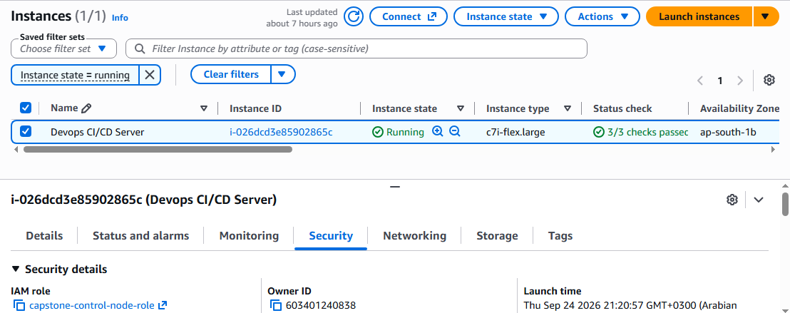

**Security group attached**

> All ports are allowd only from My Ip only.
> So later you may have to whitelist GitHub webhook IP CIDR to allow GitHub to securely trigger Jenkins builds without exposing Jenkins port 8080 to the entire internet.

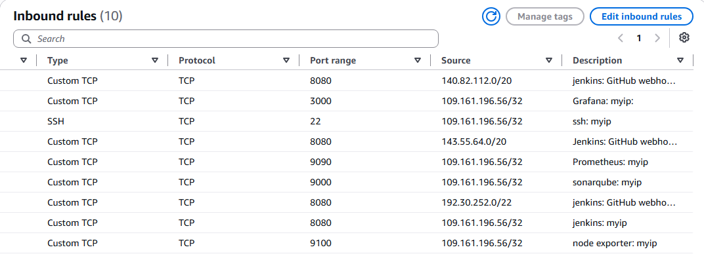

AWS identity can be verified with:

```bash
aws sts get-caller-identity
```

---

## Connect to the DevOps CI/CD EC2

``` bash
ssh -i your-key.pem ubuntu@YOUR_EC2_PUBLIC_IP
```

Update the server:

``` bash
sudo apt update
sudo apt upgrade -y
```

### 1. Install Docker

``` bash
#install
sudo apt install -y docker.io

#Enable Docker:
sudo systemctl enable --now docker

#Add the Ubuntu user to the Docker group:
sudo usermod -aG docker ubuntu

#Verify:
docker --version
```

### 2. Install AWS CLI

Check whether AWS CLI already exists:

``` bash
aws --version
```

If necessary:

``` bash
sudo apt install -y awscli
```

Verify the EC2 IAM role:

``` bash
aws sts get-caller-identity
```

This should return information associated with the EC2 instance role.

### 3. Install Terraform

Install the required packages:

``` bash
sudo apt update
sudo apt install -y gnupg software-properties-common curl
```

Add the HashiCorp repository:

``` bash
wget -O- https://apt.releases.hashicorp.com/gpg \
| gpg --dearmor \
| sudo tee /usr/share/keyrings/hashicorp-archive-keyring.gpg > /dev/null
```

``` bash
echo "deb [signed-by=/usr/share/keyrings/hashicorp-archive-keyring.gpg] https://apt.releases.hashicorp.com $(lsb_release -cs) main" \
| sudo tee /etc/apt/sources.list.d/hashicorp.list
```

Install Terraform:

``` bash
sudo apt update
sudo apt install -y terraform

#Verify:
terraform version
```

### 4. Install Jenkins

Installation steps should refer from `https://www.jenkins.io/doc/book/installing/linux/`

Install Java:

``` bash
sudo apt install -y fontconfig openjdk-21-jre
```

Install Jenkins using the current Jenkins repository instructions.
Enable and start Jenkins:

``` bash
sudo systemctl enable jenkins
sudo systemctl start jenkins

#Check status:
sudo systemctl status jenkins
```

Open `http://EC2_PUBLIC_IP:8080` from the browser and retrieve the initial administrator password from below:

``` bash
sudo cat /var/lib/jenkins/secrets/initialAdminPassword
```

Give Jenkins Docker Access. Jenkins needs Docker access for:

``` text
docker build
docker push
```

Add Jenkins to the Docker group:
``` bash
sudo usermod -aG docker jenkins

#Restart Jenkins:
sudo systemctl restart jenkins
```

### 5. Install Ansible

Ansible is responsible for installing and configuring software on the
DevOps server.

Install:

``` bash
sudo apt update
sudo apt install -y ansible

# Verify:
ansible --version
```

Test local Ansible:

``` bash
ansible localhost -m ping -c local
```

Expected result:

``` text
localhost | SUCCESS => {
    "changed": false,
    "ping": "pong"
}
```

**Verfy all the versions installed above**

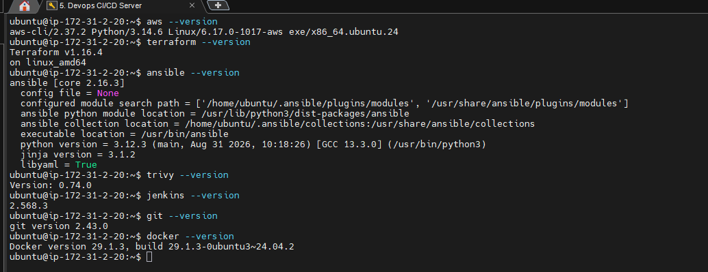

### Monitoring and Observability

The project uses two monitoring paths.

#### AWS monitoring

```text
ECS
ALB
CloudWatch Logs
CloudWatch Metrics
CloudWatch Alarms
SNS
```
This will be created by Infra pipeline.

#### DevOps server monitoring

```text
Node Exporter
      |
      v
Prometheus
      |
      v
Grafana
      |
      v
Dashboards + Alerts
```
Ansible does installation and configuraion of Devops CI/CD server monitoring.

#### 5.1 Create the Ansible Inventory

Create as below or simply you can name the inventory file as `hosts`

``` text
ansible/inventory.ini
```
 
Contents:

``` ini
[devops]
localhost ansible_connection=local
```

> If you running the ansible for the remote server or If you later use a separate monitoring EC2, configure inventory as below and control node ssh key should be added in managed nodes.

```ini
[devops]
monitoring ansible_host=<MONITORING_EC2_IP> ansible_user=ubuntu
```

Test:

``` bash
cd ansible
ansible all -i inventory.ini -m ping
```
Expected:

``` text
localhost | SUCCESS => {
    "changed": false,
    "ping": "pong"
}
```

#### 5.2 Ansible Configuration

Ansible is used for configuration management of the DevOps server.
The main playbook coordinates the roles.

```yaml
---
- name: Configure DevOps Server
  hosts: devops
  become: true

  roles:
    - trivy
    - sonarqube
    - node_exporter
    - prometheus
    - grafana
```

#### 5.3 Ansible workflow

```text
Jenkins
   |
   v
Ansible
   |
   +--> Install Trivy
   +--> Configure SonarQube
   +--> Install Node Exporter
   +--> Configure Prometheus
   +--> Install Grafana
   +--> Configure monitoring
```

Ansible can also be executed manually during development:

```bash
cd ansible

ansible-playbook -i inventory.ini site.yml --syntax-check

ansible-playbook -i inventory.ini site.yml --check

ansible-playbook -i inventory.ini site.yml
```

> Moved all ansible playbook in Jenkins:

[Refer the Jenkins job code ](jenkins/Jenkinsfile.ansible)

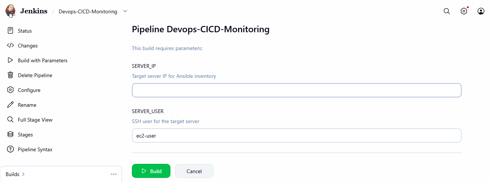

### 6. Verification

After the playbook completes, verify that all the tools installed and configured by Ansible are working.

**Ansible playbook Output**
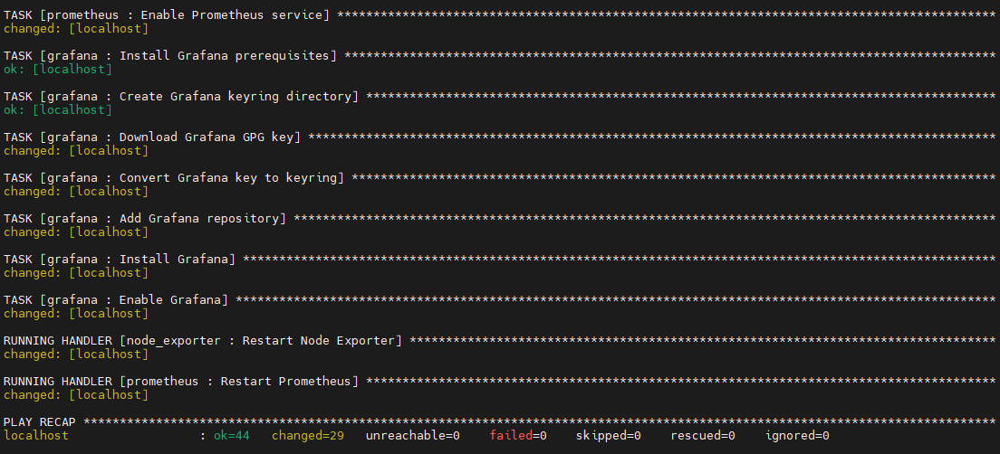

**Check versions**

```bash
trivy --version
node_exporter --version
prometheus --version
grafana-server -v
```

**Check services are running and enabled**

```bash
sudo systemctl status node_exporter
sudo systemctl status prometheus
sudo systemctl status grafana-server
sudo systemctl status sonarqube   # or: docker ps | grep sonarqube
```

**Check the web endpoints**

| Tool | URL | Expected result |
|---|---|---|
| SonarQube | `http://<DEVOPS_EC2_IP>:9000` | Login page |
| Prometheus | `http://<DEVOPS_EC2_IP>:9090` | Status → Targets shows `UP` |
| Grafana | `http://<DEVOPS_EC2_IP>:3000` | Login page, Prometheus data source working |
| Node Exporter | `http://<DEVOPS_EC2_IP>:9100/metrics` | Metrics output |

If any tool is not running, re-run the playbook and check the task output for errors

#### 6.1 Node Exporter Dashboard

Node Exporter exposes Linux host metrics.

Examples include:

```text
CPU
Memory
Disk
Filesystem
Network
Load
```

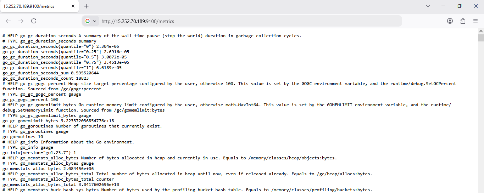

#### 6.2 Prometheus Dashboard

Prometheus collects metrics from Node Exporter.

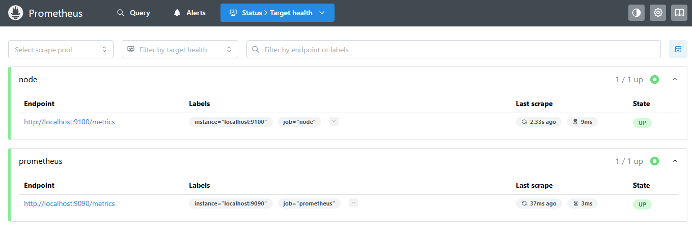

#### 6.3 Grafana UI

Grafana visualizes Prometheus metrics. Prometheus is configured as the Grafana data source.

Example:

```text
Grafana
   |
   v
Prometheus
   |
   v
Node Exporter
   |
   v
DevOps EC2
```

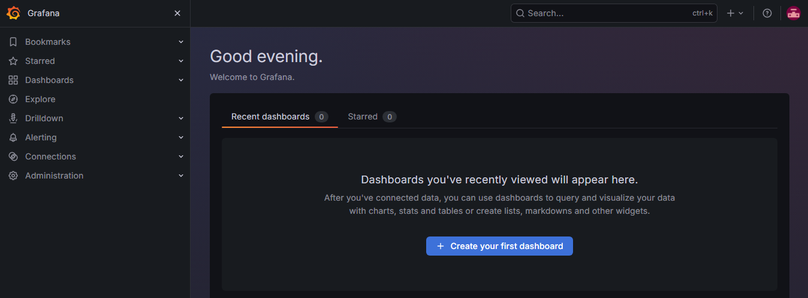

#### 6.3.1 Connect Grafana to Prometheus (Same Server)

1. Open Grafana → **Connections → Data sources → Add data source**.
2. Select **Prometheus**.
3. Set URL to `http://localhost:9090` (Prometheus and Grafana are on the same EC2).
4. Leave authentication off (local connection).
5. Click **Save & test** — confirm it shows a successful connection.

Once the data source is connected, continue with the dashboard import and alert steps below.

#### 6.3.2 Configure Grafana Dashboard (Import) + Alert

**Import the dashboard**

1. Open Grafana → **Dashboards → New → Import**.
2. Enter a dashboard ID (e.g. `1860` for Node Exporter Full) or upload your exported JSON [Refer the exported JSON ](grafana/grafana-dashboard.json).
3. Select **Prometheus** as the data source.
4. Click **Import**.
5. Confirm CPU, Memory, Disk, Network, and Load panels are populated.

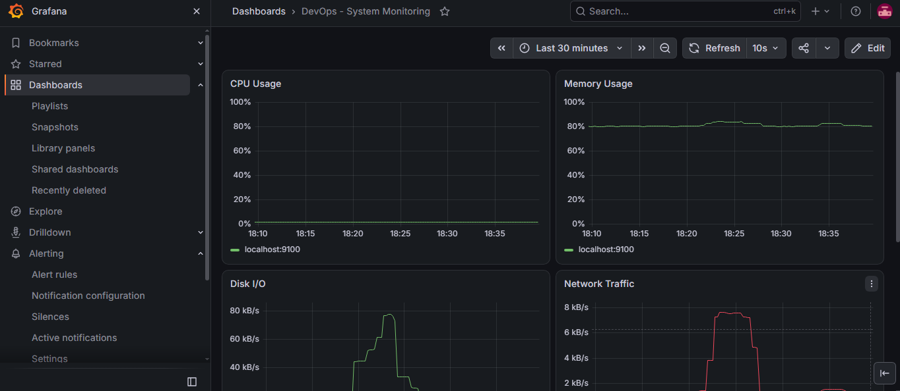

**Configure an alert**

1. Open a panel (e.g. CPU or Memory) → **Edit → Alert tab → Create alert rule**.
2. Set the condition, e.g. `WHEN avg() OF query(A) IS ABOVE 80`.
3. Set **Evaluate every** `1m`, **For** `5m` (avoids alerting on brief spikes).
4. Under **Contact points**, select or create one (e.g. Email → your address).
5. Save the rule.
6. Trigger a test load and confirm the alert fires and the notification is received.

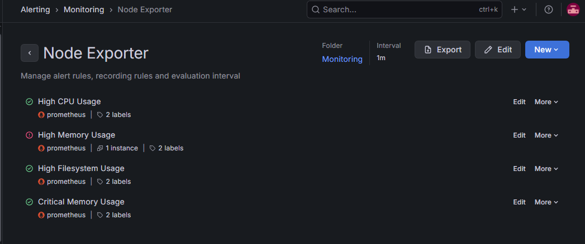

#### 6.3.4 Alert Received
The memory alert rule fired as expected once usage crossed the threshold for the configured evaluation period, and the notification was received by email.

**High Memory Usage >80%**

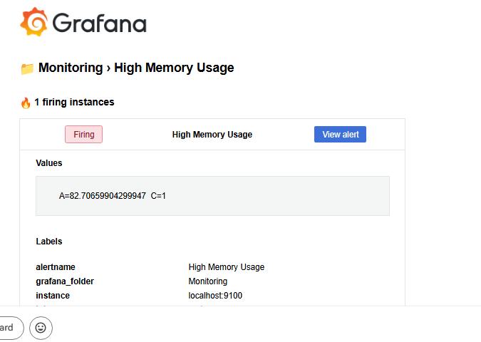

**Critical Memory Usage >90%**

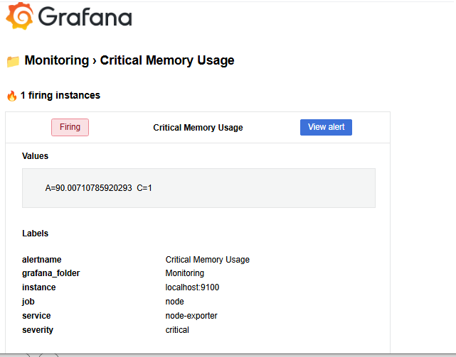

**Resolved** 

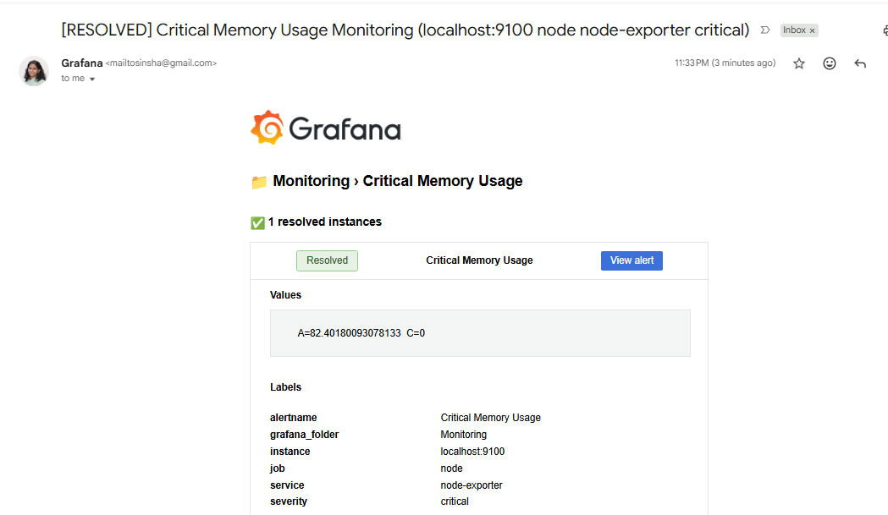


#### 6.4 SonarQube Dashboard

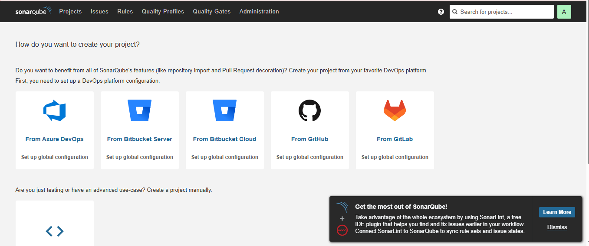

#### 6.4.1 SonarQube Configuration

1. Log in to SonarQube → **My Account → Security → Generate Token**. No expiration needed for a dedicated Jenkins token.
2. Copy the token immediately — it's shown only once.
3. In Jenkins: **Manage Jenkins → Credentials → System → Global credentials → Add Credentials** → store it as a `Secret text` credential (e.g. `sonarqube-token`).
4. **Manage Jenkins → System → SonarQube servers**:
```text
   Name:        SonarQube
   Server URL:  http://localhost:9000
   Credential:  sonarqube-token
```

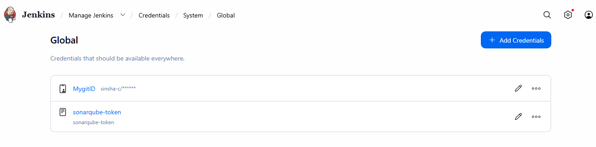

5. In SonarQube: **Administration → Configuration → Webhooks → Create**, so SonarQube can report Quality Gate pass/fail back to Jenkins:
```text
   Name:   Jenkins
   URL:    http://<JENKINS_PRIVATE_IP>:8080/sonarqube-webhook/
   Secret: (leave empty)
```

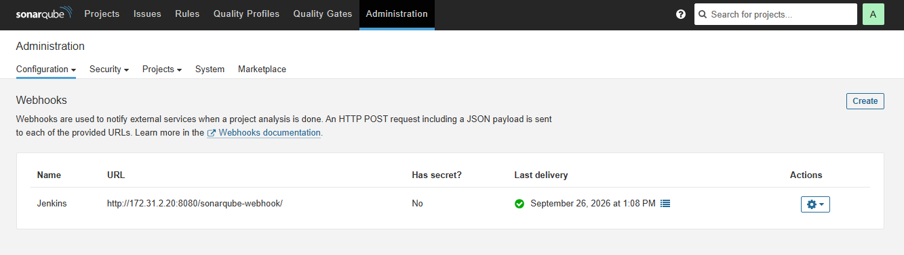

6. **Manage Jenkins → Tools → SonarQube Scanner installations → Add SonarQube Scanner**, name it `sonar-scanner`.

> Never commit the token to GitHub, the Jenkinsfile, or Terraform files.

#### 6.5 Trivy and other versions

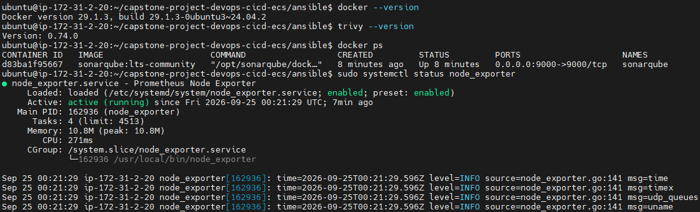

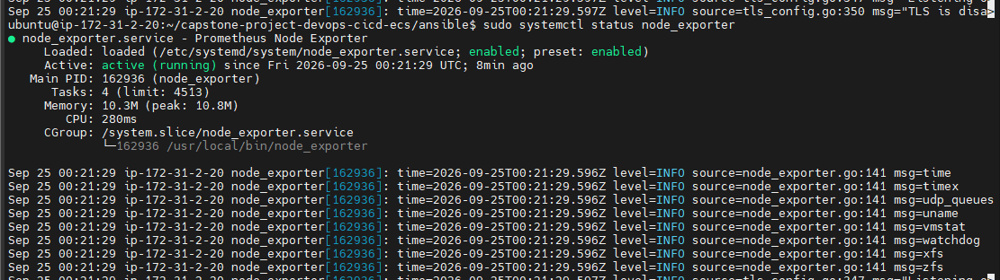

#### 6.6 Jenkins & GitHub Webhook

- Configure Jenkins with the required plugins, tools, credentials, and pipeline settings.
- Then add a GitHub Webhook pointing to the Jenkins /github-webhook/ endpoint to automatically trigger the CI/CD pipeline on repository changes.
- Added git credentails to jenkins: Manage Jenkins → Credentails → Add Credentials → username with password.
- Added AWS_REGION and Project REPO_URL as Environment variables in jenkins: Manage Jenkins → System → Environment variables.

---

## Terraform Infrastructure Pipeline

Terraform is the source of truth for AWS infrastructure.

The infrastructure Jenkins pipeline follows:

```text
GitHub
   |
   v
Jenkins
   |
   +--> Checkout
   |
   +--> Terraform Init
   |
   +--> Terraform Format
   |
   +--> Terraform Validate
   |
   +--> Terraform Plan
   |
   +--> Manual Approval
   |
   +--> Terraform Apply
   |
   v
AWS Infrastructure
```

**Terraform owns**

```text
VPC
Subnets
Route Tables
NAT Gateway
Security Groups
ECR
ECS Cluster
ECS Services
Task Definition foundation
ALB
Target Groups
Listeners
IAM
CloudWatch
SNS
S3 backend
```

**Typical commands:**

```bash
terraform init
terraform fmt
terraform validate
terraform plan
terraform apply
```

### 7.1 Terraform Modules

The infrastructure is divided into modules.

```text
terraform/modules/

vpc/
security/
ecr/
iam/
alb/
ecs/
cloudwatch/
```
This keeps the Terraform code modular and easier to maintain.

---

> All these are running from jenkins called Infra Pipeline. The pipeline contains an approval step before applying infrastructure changes.

[Refer the Jenkins job code ](jenkins/Jenkinsfile.terraform)

This provides a controlled infrastructure deployment process.

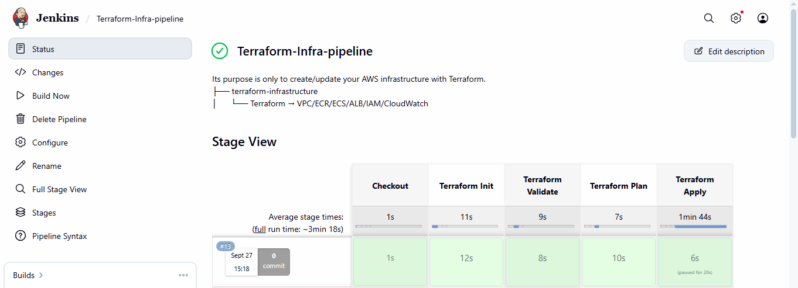

#### 7.1 Infra Pipeline Required Inputs Before Apply

Before running `terraform plan` / `terraform apply`, create `terraform/terraform.tfvars` with the project-specific values. Terraform will not apply without these.

```hcl
aws_region = "ap-south-1"

project_name = "capstone-devops-cicd"

vpc_cidr = "10.0.0.0/16"

public_subnet_cidrs = [
  "10.0.1.0/24",
  "10.0.2.0/24"
]

private_subnet_cidrs = [
  "10.0.11.0/24",
  "10.0.12.0/24"
]

container_port = 80

jenkins_source_ip = "15.252.70.189/32"

desired_count = 1

alert_email = "mailtosinsha@gmail.com"
```

| Variable | Description |
|---|---|
| `aws_region` | AWS region all resources are deployed into |
| `project_name` | Prefix used to name every resource (ALB, ECS cluster, ECR repo, etc.) |
| `vpc_cidr` | CIDR block for the VPC |
| `public_subnet_cidrs` | CIDRs for the two public subnets (ALB, NAT Gateway) |
| `private_subnet_cidrs` | CIDRs for the two private subnets (ECS Blue/Green tasks) |
| `container_port` | Port the application container listens on |
| `jenkins_source_ip` | Your IP in CIDR form — restricts SSH/tooling ports on the DevOps EC2 security group |
| `desired_count` | Number of ECS tasks to run per service |
| `alert_email` | Email address subscribed to the SNS topic for CloudWatch alarms |

> `terraform.tfvars` is excluded from Git if it contains anything environment-specific or sensitive — keep only a `terraform.tfvars.example` committed with placeholder values, and add the real file to `

> After creating or editing `alert_email`, remember to confirm the SNS subscription email AWS sends — alarms won't deliver until it's confirmed.

### 7.2 Infra pipeline asking confirmation to approve
- Verify all the terraform plan output and approve

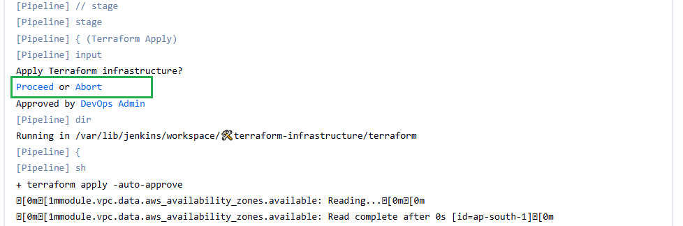

### 7.3 Infra pipeline Deployment Success

Once `terraform apply` completes, confirm the summary line shows resources were created with no errors:

```text
Apply complete! Resources: 6 added, 2 changed, 0 destroyed.
```

**Note down the output values** — the application pipeline and validation steps reference these directly:

**Verify every resource actually exists in AWS** before moving on to the application pipeline:

| Output | Verify with |
|---|---|
| `vpc_id` | `aws ec2 describe-vpcs --vpc-ids <vpc_id>` |
| `public_subnet_ids` | `aws ec2 describe-subnets --subnet-ids <id1> <id2>` |
| `ecr_repository_name` | `aws ecr describe-repositories --repository-names <ecr_repository_name>` |
| `ecs_cluster_name` | `aws ecs describe-clusters --clusters <ecs_cluster_name>` |
| `ecs_blue_service_name` / `ecs_green_service_name` | `aws ecs describe-services --cluster <ecs_cluster_name> --services <service_name>` |
| `task_definition_arn` | `aws ecs describe-task-definition --task-definition <task_definition_arn>` |
| `alb_dns_name` | `aws elbv2 describe-load-balancers --names capstone-devops-cicd-alb` |
| `blue_target_group_arn` / `green_target_group_arn` | `aws elbv2 describe-target-groups --target-group-arns <arn>` |
| `alb_listener_arn` / `test_listener_arn` | `aws elbv2 describe-listeners --load-balancer-arn <alb_arn>` |
| `cloudwatch_log_group` | `aws logs describe-log-groups --log-group-name-prefix <cloudwatch_log_group>` |

Finally, open `application_url` in a browser and confirm the application responds. If it doesn't yet — that's expected before the first application deployment has run.

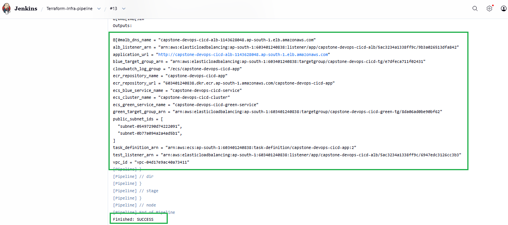

#### 7.4 TTerraform Backend — Remote State in S3
Before running `terraform init`, confirm the backend is configured so state is stored remotely in S3 instead of locally on the Jenkins workspace.

**terraform/backend.tf**

```hcl
terraform {
  backend "s3" {
    bucket = "sinsha-capstone-devops-tfstate"
    key    = "capstone/terraform.tfstate"
    region = "ap-south-1"
  }
}
```

> The S3 bucket must exist **before** running `terraform init` — Terraform does not create its own backend bucket. Create it once, manually or via a small bootstrap script, with versioning enabled so previous state files aren't lost:
> ```bash
> aws s3api create-bucket --bucket sinsha-capstone-devops-tfstate --region ap-south-1 \
>   --create-bucket-configuration LocationConstraint=ap-south-1
> aws s3api put-bucket-versioning --bucket sinsha-capstone-devops-tfstate \
>   --versioning-configuration Status=Enabled
> ```

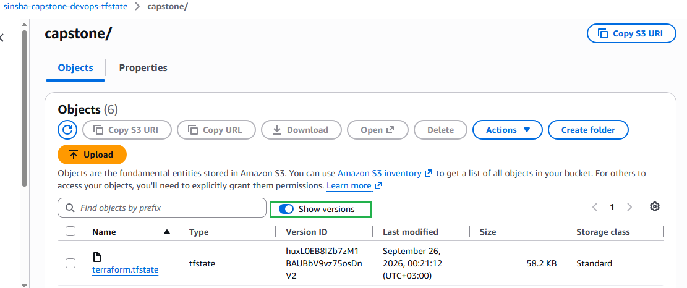

> The repository excludes Terraform state files:

```gitignore
.terraform/
*.tfstate
*.tfstate.*
crash.log
crash.*.log
```
---

## Application CI/CD Pipeline

The application pipeline is intentionally separate from the infrastructure pipeline.

It does **not** run `terraform apply/destroy`

The application pipeline is responsible for delivering a new application version onto already-provisioned infrastructure.

## Application Pipeline Overview

The application pipeline is a Jenkins pipeline (`Jenkinsfile`) that runs on every push to GitHub. It takes the app from source code to a live Blue/Green deployment on Amazon ECS Fargate, with security gates along the way.

**What it does, in order:**

1. **Checkout**: pulls the latest code from GitHub.
2. **SonarQube Analysis and Quality Gate**: scans the code for bugs and vulnerabilities. The pipeline stops here if the gate fails.
3. **Docker Build**: builds the container image, tagged with the Git commit SHA.
4. **Trivy Scan**: scans the image for known vulnerabilities. Critical findings stop the pipeline.
5. **Push to ECR**: stores the verified image in Amazon ECR.
6. **Register Task Definition**: creates a new ECS task definition revision that points to the new image.
7. **Deploy to Inactive Color**: updates the idle Blue or Green service with the new revision, so live traffic is untouched.
8. **Wait for ECS Stable and Check Target Health**: confirms the new tasks are running and healthy behind the ALB.
9. **App Verification**: tests the new version on the ALB test listener (port 8080).
10. **Switch ALB Listener (port 80)**: moves production traffic to the new color.
11. **Production Verification**: confirms the live URL responds correctly. If it fails, `Jenkinsfile.rollback` switches traffic back.

Nothing reaches production until the code, the image and the running tasks have all passed their checks.

### Pipeline View

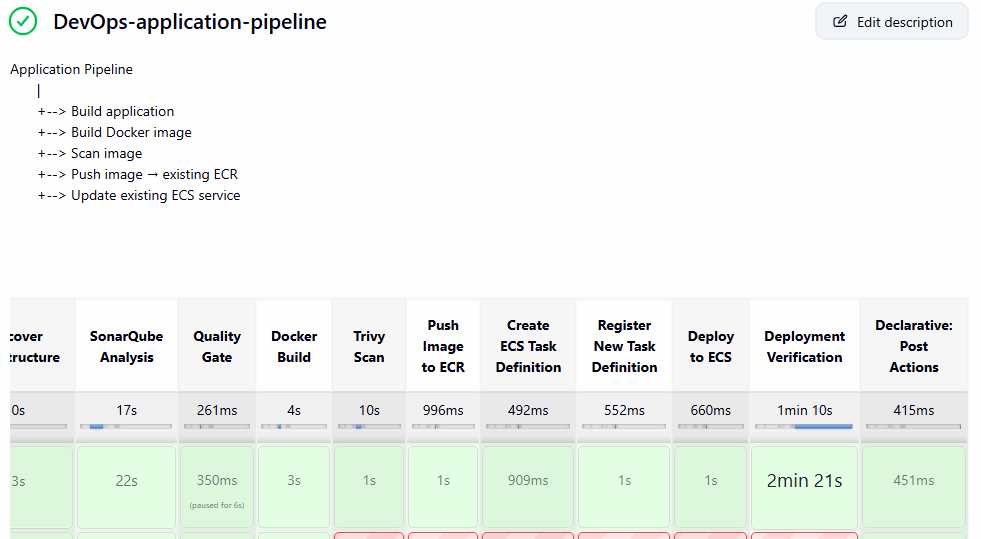


*Jenkins Stage View showing every stage of the application pipeline completing successfully.*

### Pipeline Success view

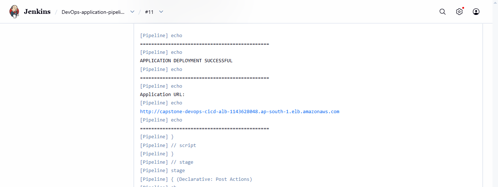

---

Each stage is explained in detail below.

### 8.1 Docker Application

The application is packaged using Docker.

The Docker build context is:

```text
./app
```

The container runs Nginx and serves the project `index.html`.

The container also includes a health check against:

```text
http://127.0.0.1/
```

```Dockerfile
FROM nginx:alpine

RUN apk update && apk upgrade

COPY index.html /usr/share/nginx/html/index.html

EXPOSE 80

HEALTHCHECK --interval=30s --timeout=3s \
    CMD wget -q -O /dev/null http://127.0.0.1/ || exit 1

```

This allows the container and load-balancer health mechanisms to detect whether the application is responding.

### 8.2 SonarQube Integration

SonarQube is used for static code quality analysis.

The project configuration includes:

```properties
sonar.projectKey=capstone-devops-app
sonar.projectName=Capstone DevOps Application
sonar.sources=app
sonar.exclusions=terraform/**,ansible/**
```

This intentionally focuses application analysis on the application directory.

The Jenkins workflow is:

```text
Jenkins ──▶ SonarQube Scanner ──▶ SonarQube Server ──▶ Quality Gate ─┬─ PASSED ──▶ Continue
                                                                     │
                                                                     └─ FAILED ──▶ Stop Pipeline
```

The SonarQube token is stored as a Jenkins credential and is not committed to GitHub.

**SonarQube View of The project**

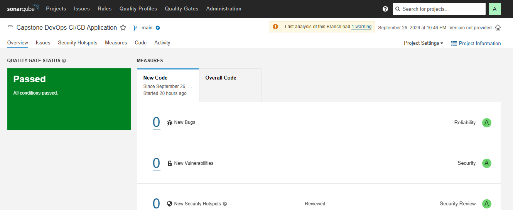

---

### 8.3 Container Security with Trivy

Trivy scans the Docker image before it is pushed to ECR. The pipeline blocks on `HIGH` and `CRITICAL` vulnerabilities that have a fix available.

```bash
trivy image \
  --exit-code 1 \
  --severity HIGH,CRITICAL \
  --ignore-unfixed \
  "${IMAGE_URI}"
```

If a blocking vulnerability is found, the pipeline stops before the image reaches ECR or deployment.

#### Failed Scan

The first run failed because the Alpine base image had outdated packages with known HIGH/CRITICAL vulnerabilities. The pipeline stopped and nothing was pushed or deployed.

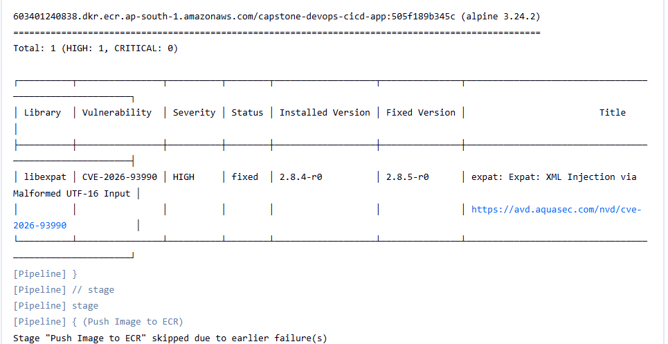

*Jenkins Stage View showing the failed stage.*

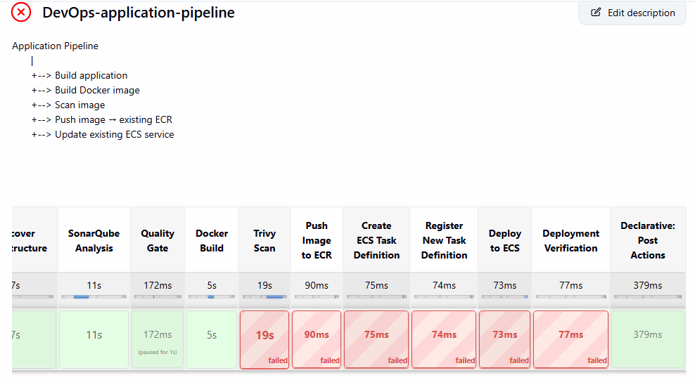

#### Fix

Since patched versions were available, I updated the packages in the `Dockerfile`:

```dockerfile
RUN apk update && apk upgrade
```

#### Passed Scan

After the fix, Trivy found no blocking vulnerabilities and the pipeline continued to ECR and deployment.

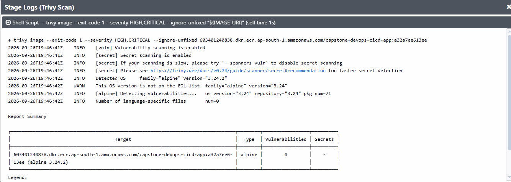

---

### 8.4 Amazon ECR

Terraform creates the ECR repository.

The resulting flow is:

```text
Git Commit ──▶ Docker Image ──▶ Trivy Scan ──▶ ECR
```

Jenkins authenticates using the EC2 IAM role:

```bash
aws ecr get-login-password --region ap-south-1 |
docker login --username AWS --password-stdin <ECR_REPOSITORY>
```

The image is then pushed:

```bash
docker push "${IMAGE_URI}"
```

Only images that pass the security gate reach this stage.

#### ECR Images

The ECR repository shows the pushed images, each tagged with its Git commit SHA.

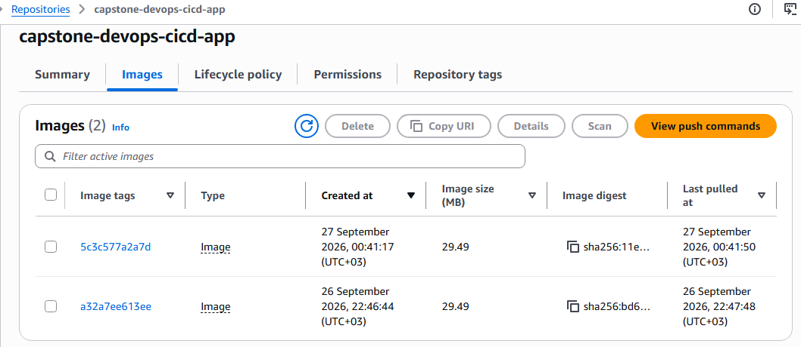

*Amazon ECR repository listing the images pushed by the Jenkins pipeline.*

---

### 8.5 ECS Fargate Application Platform

The application runs on ECS Fargate.

The project uses:

```text
ECS Cluster
   |
   +-- Blue Service
   |
   +-- Green Service
```

Both services use:

```text
Fargate
awsvpc networking
Private subnets
ECS security group
ALB target group
```
The ECS tasks do not receive public IP addresses.

#### ECS Services Running

The ECS cluster has both the Blue and Green services, each with its desired number of tasks in the `RUNNING` state.

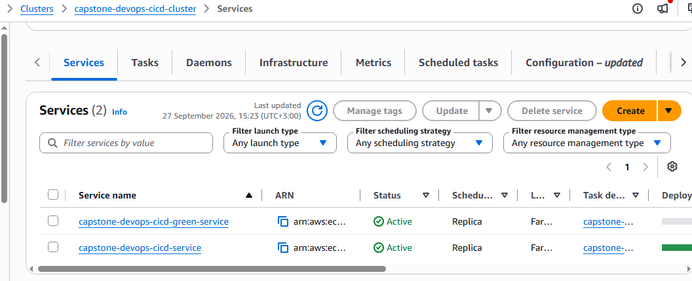

*ECS cluster with the Blue and Green services active.*

#### ECS Tasks Created

Each service launches its tasks on Fargate using the latest task definition revision, which points to the image pushed to ECR.

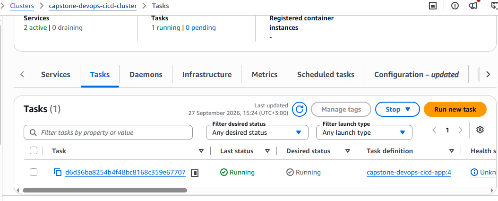


*Tasks created by the service and running on Fargate.*

#### Private Networking Preview

The task details show that each task runs in a private subnet with the ECS security group attached and no public IP assigned. Traffic reaches the application only through the ALB.

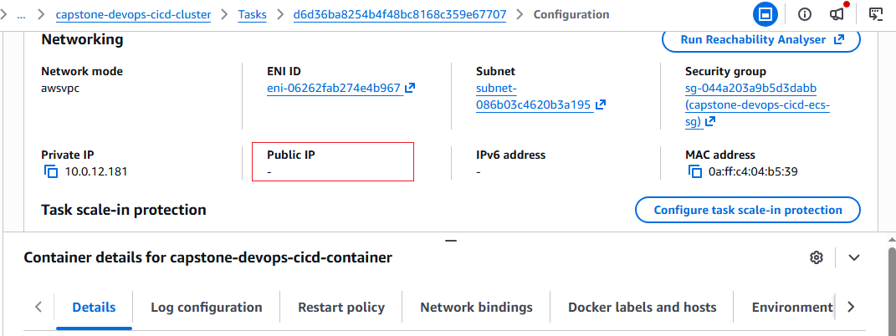

*Task network details showing the private subnet, private IP only and no public IP.*

#### ECS Service Running Count

The `aws ecs describe-services` output confirms that both services exist and are `ACTIVE`, but only the Blue service is running tasks at this point:

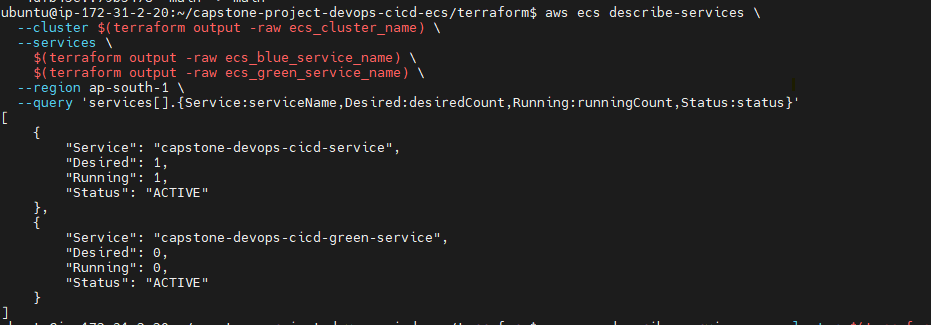

Blue is serving production with one running task. Green is created and ready but idle, with no tasks running and no cost, until the pipeline deploys a new version to it.

*Blue service running 1 task, Green service active with 0 tasks.*

---

### 8.6 Custom Blue-Green Deployment

This project uses a **custom Blue-Green deployment strategy without AWS CodeDeploy**.

The infrastructure contains:

```text
ECS Cluster
    |
    +--------------------+
    |                    |
    v                    v
Blue Service        Green Service
    |                    |
    v                    v
Blue Target Group   Green Target Group
    |                    |
    +---------+----------+
              |
              v
        Application ALB
```

The production listener is:

```text
ALB :80
```

Only one target group receives production traffic at a time.

---

## 9. Blue-Green Deployment Logic

Assume Blue is currently serving production.

```text
Production:

ALB :80 ──▶ Blue Target Group ──▶ Blue ECS Service ──▶ Version 1
```

A developer makes a new application change.

Jenkins builds:

```text
Version 2
```

Instead of replacing the production Blue service immediately, Jenkins deploys the new revision to Green.

```text
ALB :80 ──▶ Blue ──▶ Version 1

            Green ──▶ Version 2   (no production traffic yet)
```

Jenkins then validates Green.

After successful validation:

```text
ALB :80 ──▶ Green ──▶ Version 2
```

Blue can remain available for rollback.


### 9.1 Jenkins Job Success

The Jenkins application pipeline completed successfully, with every stage passing from checkout to production verification.

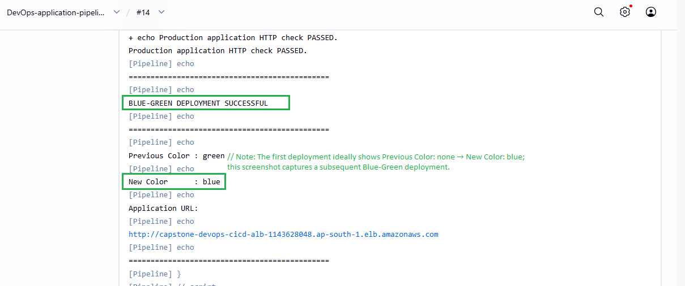


*Jenkins Stage View showing the full pipeline completing successfully.*

### 9.2 Blue Deployment Final Output

The final application output served through the ALB while Blue is live in production (Version 1).

<p align="center">
  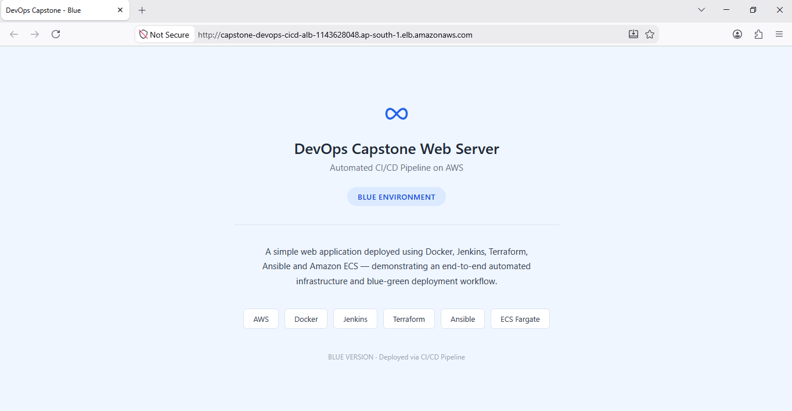
</p>

*Application running on the Blue deployment, opened through the ALB DNS name.*

---

### 9.3 Deployment Color Switching

The application pipeline determines the currently active color and deploys the new version to the other service.
This creates an alternating deployment pattern.

Example:

```text
Deployment 1
Blue  -> Production

Deployment 2
Green -> Production

Deployment 3
Blue  -> Production

```

### Green Deployment

In the second deployment, Blue was already serving production, so Jenkins deployed the new version to Green. The ALB switched to Green only after the pipeline validated it, and Blue stayed available for rollback.

```text
Before:  ALB :80 ──▶ Blue ──▶ Version 1
                     Green ──▶ Version 2 (validated)

After:   ALB :80 ──▶ Green ──▶ Version 2
                     Blue ──▶ Version 1 (kept for rollback)
```

#### Testing the Green Deployment

To test the Green deployment, I made a small change to the application code and committed it to Git. The commit automatically triggered the Jenkins job, which built the new image, ran the security gates and deployed it to the inactive color (Green).

> **Note:** The page background color in the application was changed to green only to make the new version easy to recognize in the screenshots. The color has nothing to do with the Green deployment itself. Blue and Green are just names for the two ECS services, and the application content can be anything.

#### Jenkins Success Log

The Jenkins console output shows the pipeline deploying to the inactive color, passing the health and verification checks, switching the ALB listener and finishing with `SUCCESS`.

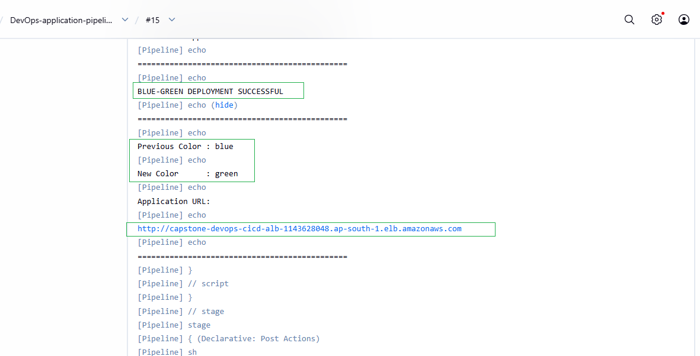

*Jenkins console log for the Green deployment, ending with SUCCESS.*

#### Green Deployment Final Output

The final application output served through the ALB after traffic moved to Green (Version 2).

<p align="center">
  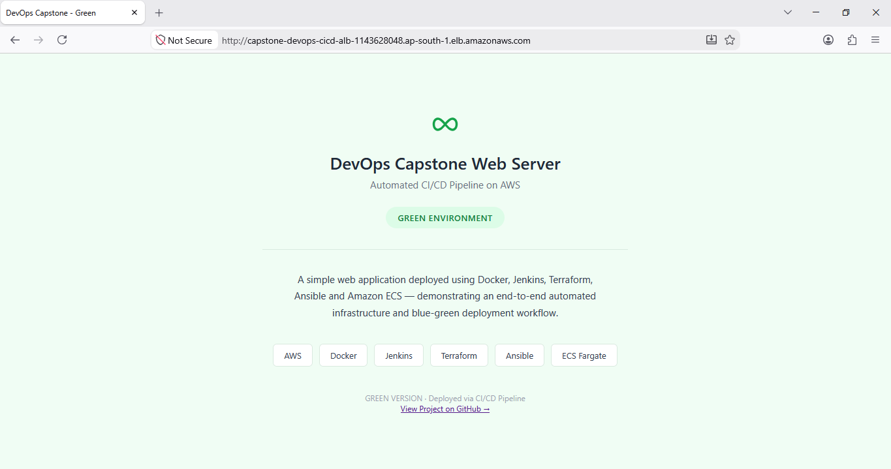
</p>

*Application running on the Green deployment, opened through the ALB DNS name.*

---

## 10. ALB Target Groups

The ALB has two target groups, one for each color:

```text
capstone-devops-cicd-blue-tg
capstone-devops-cicd-green-tg
```

Each has an HTTP health check on path `/` expecting `200`. Traffic goes only to ECS tasks that pass it.

### 10.1 ALB Listeners

| Listener | Purpose |
|----------|---------|
| `HTTP :80` | Production listener. Forwards traffic to the active target group. This is where the Blue/Green switch happens. |
| `HTTP :8080` | Fixed test listener that always points to the Green target group. It is not the production switch. |

```text
HTTP :8080 ──▶ Green Target Group   (testing only)
HTTP :80   ──▶ Active Target Group  (production)
```

#### Verify the ALB Test Listener

Before switching production, Jenkins verifies the new version through the `:8080` test listener.

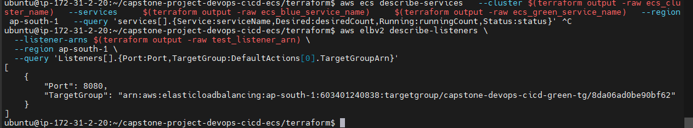


*Verification of the Green version through the ALB test listener on port 8080.*

### 10.2 Check the Active Production Color

Port 80 shows which color is serving production:

```text
ALB :80 ──▶ Default Listener Action ──▶ Target Group ──▶ Blue or Green ECS Service
```

Check the default action of the port 80 listener:

```bash
aws elbv2 describe-listeners \
  --load-balancer-arn <ALB_ARN> \
  --region ap-south-1
```

Check target health:

```bash
aws elbv2 describe-target-health \
  --target-group-arn <TARGET_GROUP_ARN> \
  --region ap-south-1
```

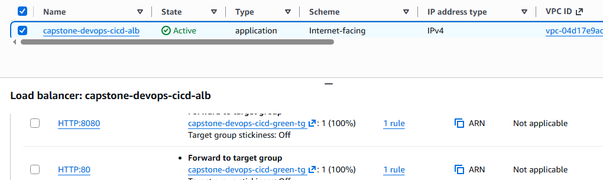


*The port 80 listener now forwards production traffic to the Green target group.*

### 10.3 ALB Security Group

The ALB security group controls which traffic can reach the load balancer. It allows inbound HTTP on port `80` (production) and port `8080` (Green test listener).

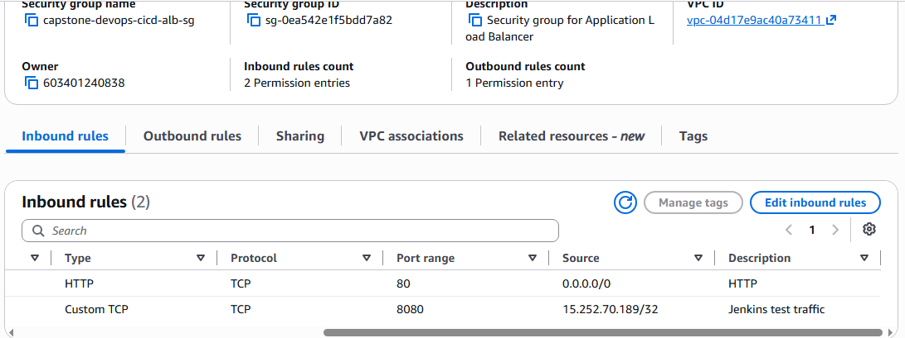


*ALB security group inbound rules.*
---

## 11. Rollback Strategy

A main benefit of the custom Blue-Green design is fast rollback.

Suppose Green is serving production and Version 2 has an application problem:

```text
ALB :80 ──▶ Green Target Group ──▶ Green ECS ──▶ Version 2   (problem found)
```

If Blue is still running Version 1, production traffic can go back to it:

```text
ALB :80 ──▶ Blue Target Group ──▶ Blue ECS ──▶ Version 1
```

Rollback does not rebuild the previous Docker image. It only points the production listener back to the previous target group:

```bash
aws elbv2 modify-listener \
  --listener-arn "<HTTP_80_LISTENER_ARN>" \
  --default-actions Type=forward,TargetGroupArn="<BLUE_TARGET_GROUP_ARN>" \
  --region ap-south-1
```

This is a traffic rollback, not an application rebuild.

> Note:
> [Refer the Jenkins job code for Manual Rollback](jenkins/Jenkinsfile.rollback)

---

## 12. CloudWatch Monitoring

CloudWatch monitors the AWS application platform.

The project includes alarms for the Blue-Green architecture.

Examples:

```text
Blue ECS High CPU
Green ECS High CPU

Blue ECS High Memory
Green ECS High Memory

Blue Target Group 5XX
Green Target Group 5XX

Blue Healthy Host Count
Green Healthy Host Count
```

The alarms use an SNS topic for notification.

### SNS Notifications

CloudWatch alarms send notifications through the SNS topic is:

```text
capstone-devops-cicd-alerts
```

The email subscription must be confirmed before SNS can deliver notifications to the configured address.


### CloudWatch Logs

ECS application logs are written to CloudWatch Logs.

The project uses a log group similar to:

```text
/ecs/capstone-devops-cicd-app
```

This allows application container logs to be inspected without connecting directly to the Fargate host.

### 11.1 Alarms Configured with Terraform

The CloudWatch alarms are created by Terraform, so monitoring is part of the infrastructure code.

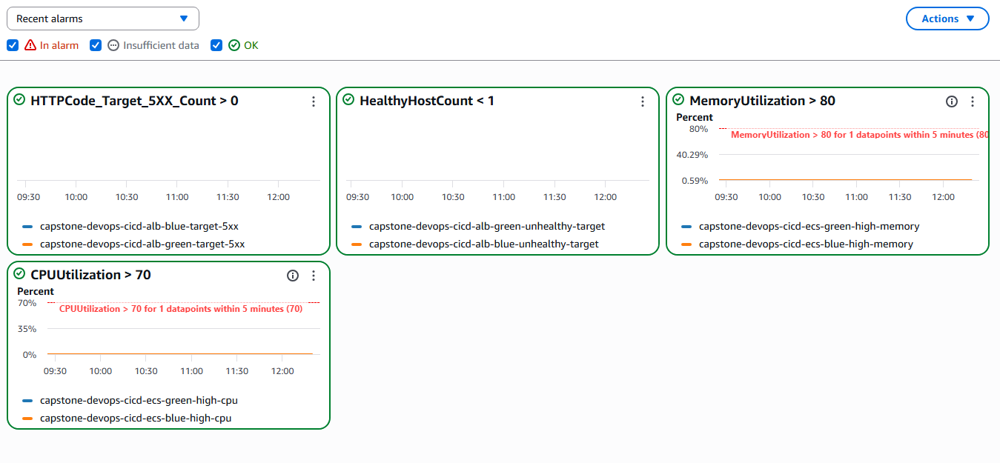


*CloudWatch alarms created by Terraform.*

### 11.2 ECS Logs and Metrics

ECS tasks send their container logs and service metrics to CloudWatch.

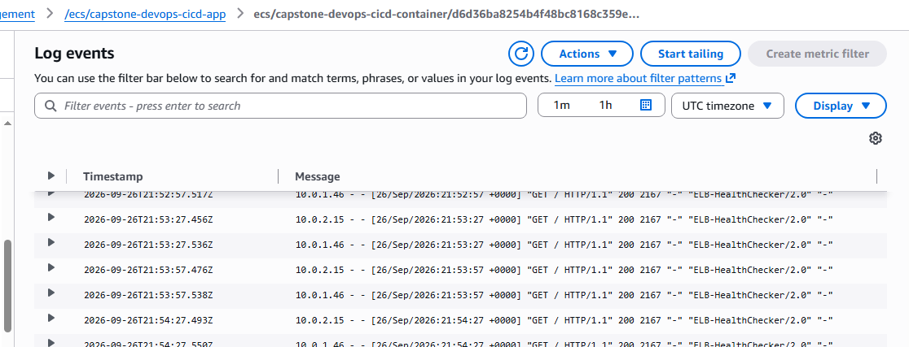


*ECS container logs in CloudWatch Logs.*

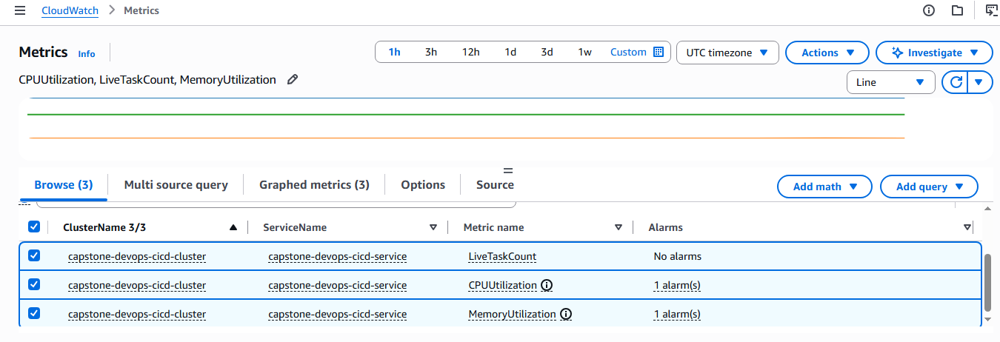


*ECS service metrics in CloudWatch.*

### 11.3 Testing the Alarm

To confirm the alarm works, I edited its settings so it would trigger easily, then checked that it changed state.

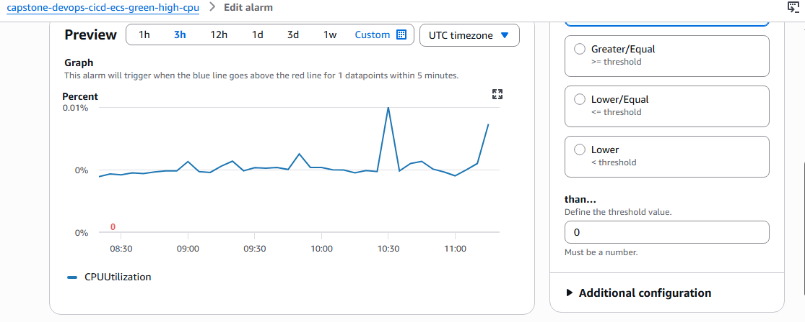


*Alarm settings edited for the test and recieved alert through mail*

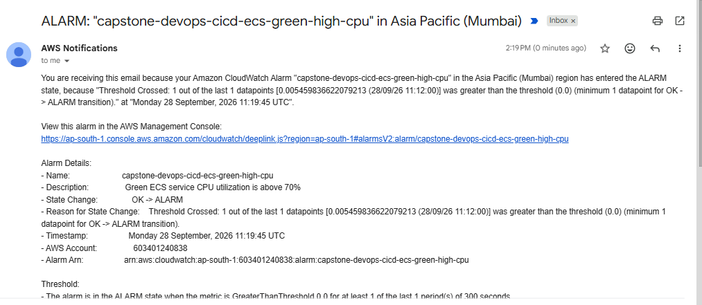


*Alarm state changed to `In alaram` .*

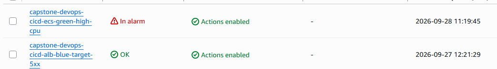

---

## Terraform Lifecycle Protection

Jenkins creates new ECS task-definition revisions during application deployment.

Therefore Terraform must not continuously attempt to revert the ECS service to the older task-definition revision stored in Terraform state.

The ECS services use:

```hcl
lifecycle {
  ignore_changes = [
    task_definition
  ]
}
```

This creates the intended ownership boundary:

```text
Terraform
   |
   +--> ECS service infrastructure

Jenkins
   |
   +--> ECS application task-definition revision
```

Without this separation, a later Terraform plan could attempt to replace the task definition selected by Jenkins.

---

## Final Validation Checklist

### Infrastructure

- [ ] VPC exists
- [ ] Public subnets exist
- [ ] Private subnets exist
- [ ] Internet Gateway exists
- [ ] NAT Gateway exists
- [ ] Route tables are associated correctly
- [ ] Security groups are correct
- [ ] ECR repository exists
- [ ] ECS cluster exists
- [ ] Blue service exists
- [ ] Green service exists
- [ ] ALB exists
- [ ] Blue target group exists
- [ ] Green target group exists
- [ ] Port 80 listener exists
- [ ] Port 8080 test listener exists
- [ ] CloudWatch alarms exist
- [ ] SNS subscription is confirmed
- [ ] Terraform state exists in S3

### DevOps server

- [ ] Jenkins running
- [ ] Docker running
- [ ] Terraform installed
- [ ] Ansible installed
- [ ] AWS CLI working
- [ ] Trivy installed
- [ ] SonarQube running
- [ ] Node Exporter running
- [ ] Prometheus running
- [ ] Grafana running

### Application pipeline

- [ ] GitHub webhook triggers Jenkins
- [ ] SonarQube analysis succeeds
- [ ] Quality Gate passes
- [ ] Docker image builds
- [ ] Trivy scan passes
- [ ] Image pushed to ECR
- [ ] ECS task definition revision registered
- [ ] Inactive ECS service becomes healthy
- [ ] Target group reports healthy targets
- [ ] Application validation succeeds
- [ ] ALB :80 switches successfully
- [ ] Production application responds

### Blue-Green validation

- [ ] Blue version can be identified
- [ ] Green version can be identified
- [ ] ALB :80 active target group can be checked
- [ ] New version is deployed to inactive color
- [ ] Previous color remains available for rollback
- [ ] ALB :80 can be switched back
- [ ] Rollback restores the previous version

---

## Important Design Decisions

### 1. Infrastructure and application pipelines are separate

Terraform should not rebuild the infrastructure every time an application developer commits code.

---

### 2. Jenkins does not store long-lived AWS access keys

The DevOps EC2 uses an IAM role.

Jenkins and AWS CLI obtain permissions through the EC2 instance profile.

---

### 3. ECS tasks are private

The ECS tasks are not directly exposed to the internet.

The ALB is the public application entry point.

---

### 4. Blue-Green does not use CodeDeploy

This project implements Blue-Green orchestration using:

```text
Jenkins
+
ECS
+
ALB Target Groups
+
ALB Listener Switching
```

This makes the deployment mechanics visible and useful for learning.

---

### 5. Git SHA tags are used for application images

Instead of relying only on:

```text
latest
```

the application pipeline creates traceable image versions using the Git commit SHA.

---

### 6. Terraform does not overwrite Jenkins task-definition revisions

The ECS service ignores task-definition changes in Terraform so Jenkins can manage application revisions safely.

---

### 7. One NAT Gateway is used

The project uses one NAT Gateway to keep the capstone architecture simpler and reduce infrastructure cost compared with deploying a NAT Gateway in every availability zone.

---

### 8. The previous color is useful for rollback

Blue-Green deployment is not only about switching traffic.

The previous environment remains valuable because it provides a fast rollback path.

---

## 13. Conclusion

This project delivers a secure, end-to-end DevOps pipeline for containerized applications on AWS. Infrastructure is provisioned as code, every code change passes automated security gates, and releases go live through a Blue-Green deployment that can be rolled back in seconds.

```text
Git Commit ──▶ Jenkins ──▶ SonarQube ──▶ Trivy ──▶ ECR ──▶ ECS Fargate (Blue/Green) ──▶ ALB :80
                                                                    │
                                                          CloudWatch + SNS Alerts
```

### Key Outcomes

| Area | What was demonstrated |
|------|-----------------------|
| **Infrastructure** | Modular Terraform for VPC, public/private subnets, NAT, ECS, ALB and IAM, with remote state in S3 |
| **Configuration** | Ansible roles that set up Docker, Jenkins, SonarQube, Prometheus, Grafana and Node Exporter |
| **CI/CD** | Jenkins pipeline with SonarQube quality gate, Trivy image scanning and Git-SHA image tags in ECR |
| **Deployment** | Custom Blue-Green release on ECS Fargate with ALB listener switching and traffic-based rollback |
| **Monitoring** | CloudWatch alarms with SNS notifications, plus Prometheus and Grafana dashboards |

### What I Learned

- Security gates should stop a bad build before it reaches deployment. Trivy caught a vulnerable Alpine image and blocked it until the base packages were patched.
- Blue-Green rollback is a traffic change, not a rebuild, so recovery takes seconds.
- Keeping infrastructure ownership (Terraform) separate from application deployment (Jenkins) prevents the two from interfering with each other.

### Possible Next Steps

- Add HTTPS with ACM and a custom domain on the ALB
- Enable ECS service auto scaling
- Add automated rollback when CloudWatch alarms fire
- Add a Jenkins webhook approval step before the production switch

---

### Project Repository

GitHub: [sinsha-c/capstone-project-devops-cicd-ecs](https://github.com/sinsha-c/capstone-project-devops-cicd-ecs)

## Author

**Sinsha C**
 
## Connect

If you're on a similar DevOps learning journey, feel free to connect or follow along:

[](https://github.com/sinsha-c)
[](https://linkedin.com/in/sinshac)